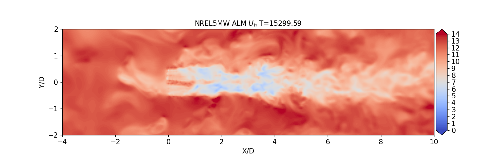
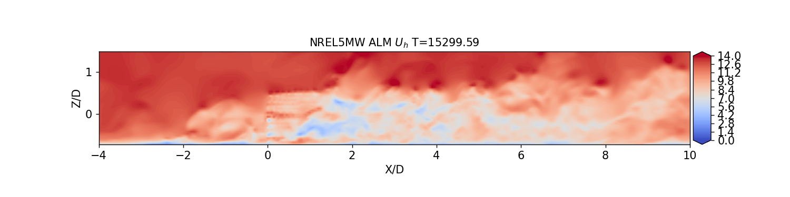
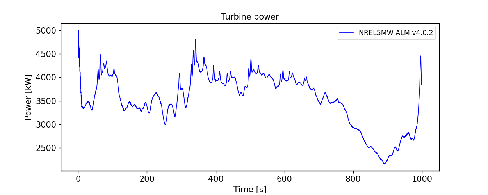
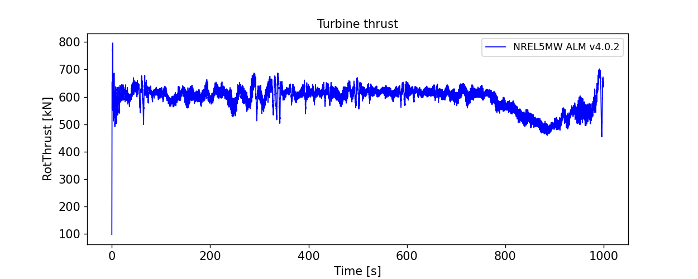
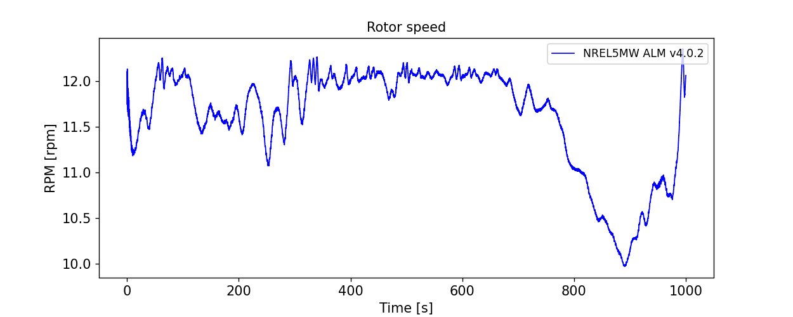
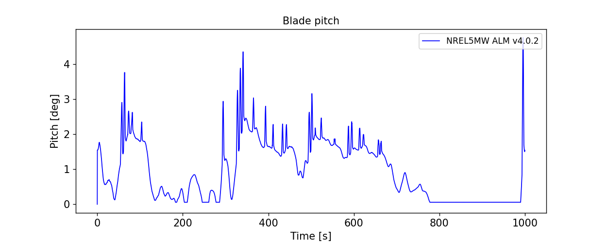
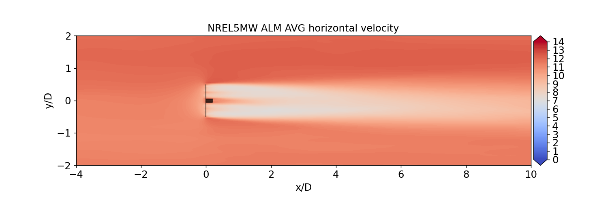
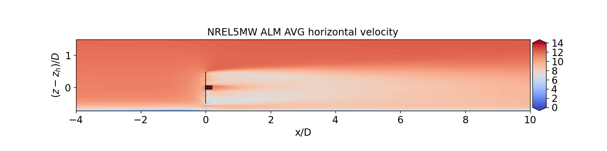
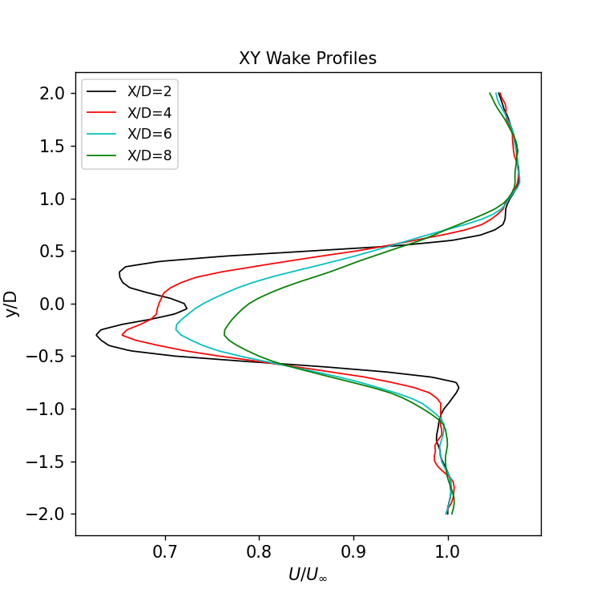
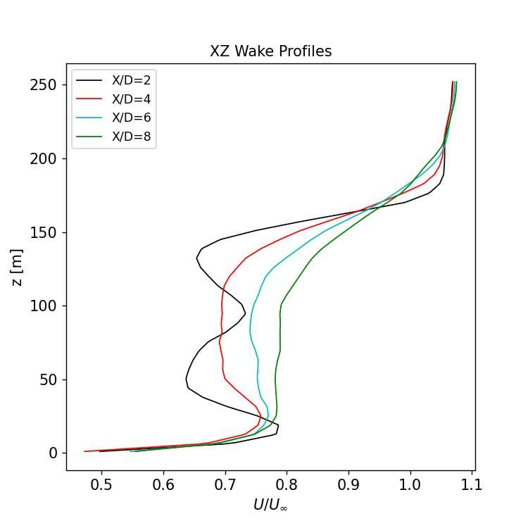

# NREL5MW results

## Contour visualizations

## Turbine results

Averaged turbine performance from t=300s to t=900s

|BldPitch1|RotSpeed|RotThrust|RotTorq |GenPwr|
|---      | ----   |---      |---     |--- |
|1.152    |11.701  |597.303  |3111.925|3621.650|

<!-- OLD RESULTS FROM DISCON.DLL --
|BldPitch1|RotSpeed|RotThrust|RotTorq |GenPwr|
|---      | ----   |---      |---     |--- |
|0.480    |11.819  |679.398  |3799.127|4460.008|
-->

## Wake profile results

